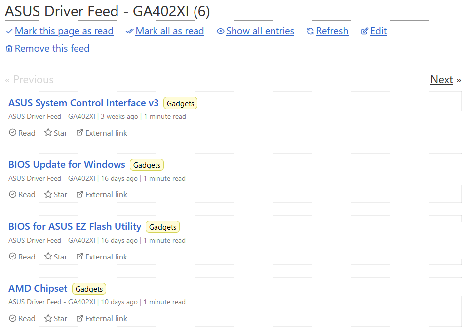
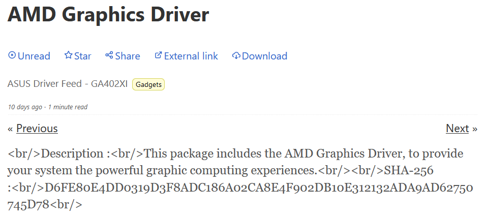
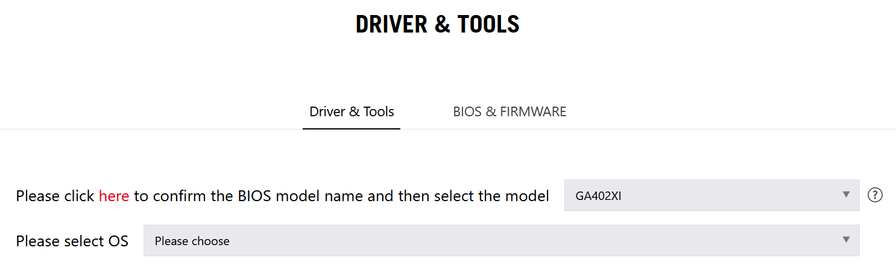
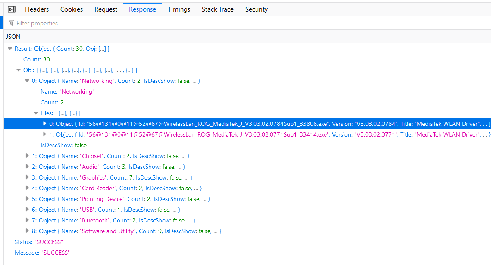

# AsusDriverFeed
Check ASUS for driver updates and rewrite as an RSS feed.

## Self-host

docker-compose.yml:
```
version: '3.2'

services:
  asus-driver-feed:
    image: ghcr.io/pettijohn/asus-driver-feed:latest-arm64 # or latest-amd64
    container_name: asus-driver-feed
    # See below for how to identify these URLs
    environment:
      - DRIVER_URL=https://rog.asus.com/support/webapi/product/GetPDDrivers?website=global&model=GA402XY&pdid=22300&mode=&cpu=GA402XI&osid=52&active=&LevelTagId=161533&systemCode=rog
      - BIOS_URL=https://rog.asus.com/support/webapi/product/GetPDBIOS?website=global&model=GA402XY&pdid=22300&cpu=GA402XI&LevelTagId=161533&systemCode=rog
      - NVIDIA_URL=https://gfwsl.geforce.com/services_toolkit/services/com/nvidia/services/AjaxDriverService.php?func=DriverManualLookup&psid=129&pfid=1006&osID=135&languageCode=1033&beta=null&isWHQL=0&dltype=-1&dch=1&upCRD=null&qnf=0&sort1=0&numberOfResults=10
      - FEED_URL=https://full.url.where.you.host.this/feed.xml
    restart: always
    networks:
      - frontend

# Optional, I prefer each service on its own named network for wiring up to reverse proxy
networks:
  frontend:
```

## In use

Here's a screenshot of the Atom feed being read in [Miniflux](https://miniflux.app/), an excellent self-hosted feed reader application.



And detail of a single driver. Note that *External Link* is a direct download to the installer.



## How to identify DRIVER_URL and BIOS_URL?

Go to https://rog.asus.com/support

Drill down to Laptops, select your model, and click *Driver & Utility*

Land on a driver page, e.g. https://rog.asus.com/laptops/rog-zephyrus/rog-zephyrus-g14-2023-series/helpdesk_download/



Hit F12, Network tab, and select your device & OS. You'll see a network request similar to https://rog.asus.com/support/webapi/product/GetPDDrivers?website=global&model=GA402XY&pdid=22300&mode=&cpu=GA402XI&osid=52&active=&LevelTagId=161533&systemCode=rog

Click Response & verify the data looks like a list of drivers.



Repeat on the BIOS tab, get a URL like https://rog.asus.com/support/webapi/product/GetPDBIOS?website=global&model=GA402XY&pdid=22300&cpu=GA402XI&LevelTagId=161533&systemCode=rog

## NVIDIA_URL ?

This one is optional. Do the same thing - start here, configure search criteria, F12/Network tab, grab the URL that shows up after you click Search. https://www.nvidia.com/en-us/geforce/drivers/ It should start with `AjaxDriverService.php`.